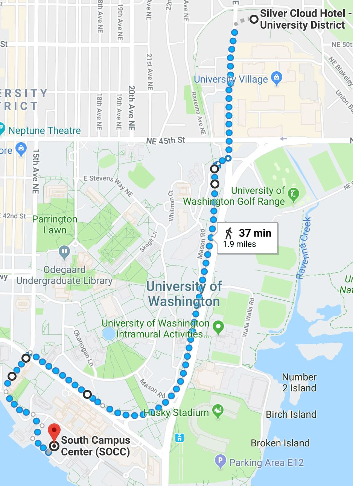

# Logistics

## Venue

* [South Campus Center UW map](http://www.washington.edu/maps/print/?building=209)
* [South Campus Center Google Maps Coordinates](https://www.google.com/maps/place/South+Campus+Center+(SOCC)/@47.6494921,-122.3131204,17z/data=!3m1!4b1!4m5!3m4!1s0x549014ee985979b3:0x76193ba01e011bc3!8m2!3d47.6494921!4d-122.3109317)

## Hotel

We have reserved a block of rooms at the [Silver Cloud Inn](https://www.silvercloud.com/university/) in Seattle's University District.

### Hotel Shuttle

A shuttle bus will run at 8:00 am and 8:30 am from the hotel to the conference location on campus.

Bus capacity:  14 people

Boarding:  Hotel front entrance

Bus leaves hotel promptly so participants must arrive the lobby before the scheduled time.
 
## Food

Food during the workshop will be provided (lunch and snacks). You can view the menu [here](menu.pdf).

## Directions

### Walking from Silver Cloud to South Campus Center

These maps show the "I don't want to get lost among south campus' maze of buildings" directions:

