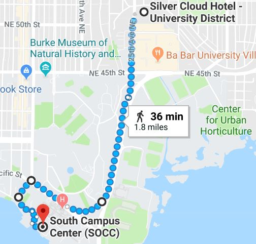
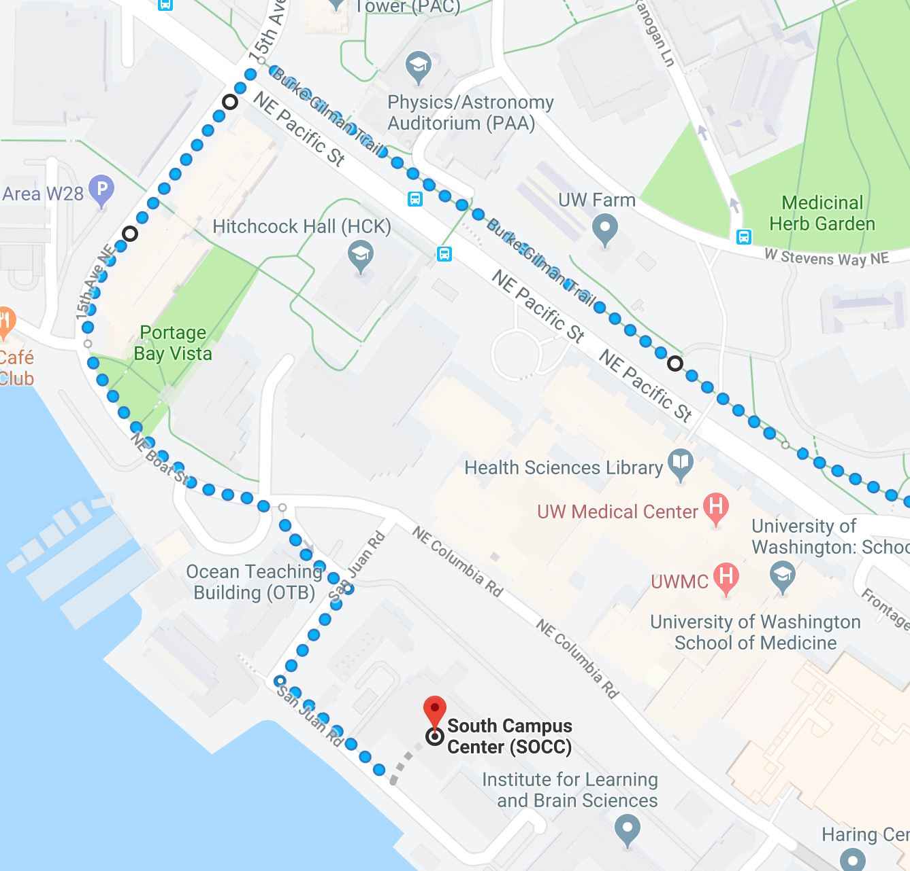

# Logistics

## Venue

* [South Campus Center UW map](http://www.washington.edu/maps/print/?building=209)
* [South Campus Center Google Maps Coordinates](https://www.google.com/maps/place/South+Campus+Center+(SOCC)/@47.6494921,-122.3131204,17z/data=!3m1!4b1!4m5!3m4!1s0x549014ee985979b3:0x76193ba01e011bc3!8m2!3d47.6494921!4d-122.3109317)

## Hotel

We have reserved a block of rooms at the [Silver Cloud Inn](https://www.silvercloud.com/university/) in Seattle's University District.

### Hotel Shuttle

A shuttle bus will run at 8:00 am and 8:30 am from the hotel to the conference location on campus.

Bus capacity:  14 people

Boarding:  Hotel front entrance

Bus leaves hotel promptly so participants must arrive the lobby before the scheduled time.
 
## Food

Food during the workshop will be provided (lunch and snacks). You can view the menu [here](menu.pdf).

## Directions

### Walking from Silver Cloud to South Campus Center

Here is a link to Google Maps directions from the Silver Cloud hotel to the Conference Venue:

[https://tinyurl.com/yaremfxv](https://tinyurl.com/yaremfxv)

## map directions

 
## zoom in to path near the conference venue
 

## Dining options

There are several dining options within walking distance from Silver Cloud:

* In the [University Village](https://uvillage.com/directory/), you can find many dining options.  There is a supermarket, QFC, at the east end of the mall.
* [Aqua Verde](http://aguaverde.com/cafe/) (Mexican)   is close to our meeting location and is by the water.
* [Ivar’s](https://www.ivars.com/locations/seafood-bars/seafood-bars-menus) (seafood)  is by the water and close to our meeting location (relatively speaking).
* If you do not mind walking, [the Ave]( https://en.wikipedia.org/wiki/The_Ave) has many options. This is where students hang out and where you can find cheap eats.
  * Myung Tong Tofu House (4142 Brooklyn Ave NE, 98105)
  * Little Thai  (4142 Brooklyn Ave NE, 98105)
  * Samurai Noodle (4138 University Way NE)
  * Shultzy’s Bar and Grill (4114 University Way NE)
  * Big Time Brewery & Alehouse (4133 University Way NE)
  * Oasis bubble tea (4508 University Way NE)